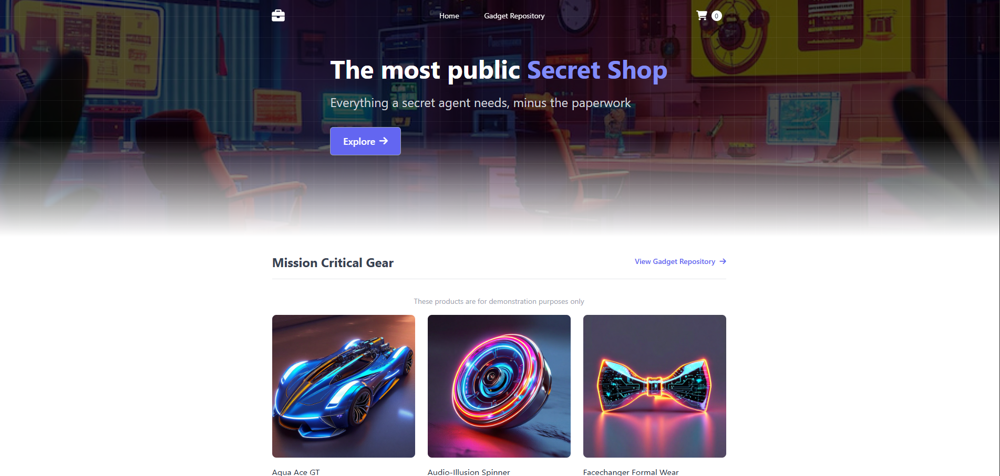

# InnovateMart Project Bedrock

## Overview
InnovateMart's Project Bedrock is an initiative to deploy a modern microservices-based retail store application on Amazon Elastic Kubernetes Service (EKS). This project aims to provide a scalable and efficient infrastructure to support InnovateMart's growth in the e-commerce sector.

## Project Structure
This is the project structure for this project.
```text
├── CODE_OF_CONDUCT.md
├── CONTRIBUTING.md
├── LICENSE
├── README.md
├── assets
│   ├── ui-home.png
│   ├── demo.mp4
│   └── .gitkeep
└── innovatemart-project-bedrock
  ├── README.md
  ├── REPROVISION.md
  ├── docs
  │   ├── ARCHITECTURE.md
  │   ├── CI_CD.md
  │   ├── COST_NOTES.md
  │   ├── DEPLOYMENT_GUIDE.md
  │   └── Deployment_Architecture_Guide.md
  ├── k8s
  │   ├── base
  │   │   ├── config
  │   │   │   └── external-secrets
  │   │   │       ├── carts-ddb-secret.yaml
  │   │   │       ├── catalog-db-secret.yaml
  │   │   │       └── orders-db-secret.yaml
  │   │   ├── deployments
  │   │   │   ├── carts.yaml
  │   │   │   ├── catalog.yaml
  │   │   │   ├── orders.yaml
  │   │   │   └── ui.yaml
  │   │   ├── kustomization.yaml
  │   │   ├── namespaces
  │   │   │   └── retail-store.yaml
  │   │   ├── rbac
  │   │   │   └── read-only-binding.yaml
  │   │   └── services
  │   │       ├── carts-svc.yaml
  │   │       ├── catalog-svc.yaml
  │   │       ├── orders-svc.yaml
  │   │       ├── ui-nodeport.yaml
  │   │       └── ui-svc.yaml
  │   ├── operators
  │   │   └── external-secrets
  │   │       └── clustersecretstore.yaml
  │   └── overlays
  │       └── sandbox
  │           └── kustomization.yaml
  ├── scripts
  │   ├── deploy-app.sh
  │   └── deploy-operators.sh
  └── terraform
    ├── envs
    │   ├── operators
    │   │   ├── README.md
    │   │   ├── backend.tf
    │   │   ├── main.tf
    │   │   ├── providers.tf
    │   │   ├── remote_state.tf
    │   │   ├── terraform.tfvars
    │   │   ├── ui_ingress.tf
    │   │   ├── variables.tf
    │   │   └── versions.tf
    │   └── sandbox
    │       ├── README.md
    │       ├── backend.tf
    │       ├── main.tf
    │       ├── outputs.tf
    │       ├── providers.tf
    │       ├── secrets.tf
    │       ├── terraform.tfvars
    │       ├── variables.tf
    │       └── versions.tf
    ├── modules
    │   ├── acm
    │   │   ├── cert.tf
    │   │   ├── outputs.tf
    │   │   └── variables.tf
    │   ├── alb-iam
    │   │   ├── main.tf
    │   │   └── variables.tf
    │   ├── dynamodb
    │   │   ├── main.tf
    │   │   ├── outputs.tf
    │   │   └── variables.tf
    │   ├── eks
    │   │   ├── cluster.tf
    │   │   ├── iam.tf
    │   │   ├── nodegroups.tf
    │   │   ├── outputs.tf
    │   │   └── variables.tf
    │   ├── iam
    │   │   ├── dev-readonly-user.tf
    │   │   ├── eks-auth.tf
    │   │   ├── outputs.tf
    │   │   ├── policies.tf
    │   │   └── variables.tf
    │   ├── rds-mysql
    │   │   ├── main.tf
    │   │   ├── outputs.tf
    │   │   └── variables.tf
    │   ├── rds-postgres
    │   │   ├── main.tf
    │   │   ├── outputs.tf
    │   │   └── variables.tf
    │   ├── route53
    │   │   ├── outputs.tf
    │   │   ├── records.tf
    │   │   ├── variables.tf
    │   │   └── zone.tf
    │   └── vpc
    │       ├── main.tf
    │       ├── outputs.tf
    │       └── variables.tf
    ├── scripts
    │   ├── README.md
    │   ├── configure-aws-auth.sh
    │   ├── create-eks-access-entry.sh
    │   ├── destroy-all.sh
    │   ├── generate-kubeconfig.sh
    │   ├── iam
    │   │   ├── README.md
    │   │   └── terraform-plan-readonly-policy.json
    │   └── install-aws-load-balancer-controller.sh
    └── state-bootstrap
      ├── README.md
      ├── main.tf
      ├── terraform.tfstate
      ├── terraform.tfstate.backup
      └── variables.tf
```
## UI Home



## Demo

[](https://youtu.be/ZHF9U0PBFJc)

- [InnovateMart Retail Store (YouTube)](https://youtu.be/ZHF9U0PBFJc)
<!---->

## Architecture
The architecture consists of several microservices, each responsible for different functionalities of the retail store application. The key components include:

- **EKS Cluster**: The core of the infrastructure, hosting all microservices.
- **Managed Databases**:
  - **PostgreSQL** for the orders service (AWS RDS).
  - **MySQL** for the catalog service (AWS RDS).
  - **DynamoDB** for the carts service.
- **Kubernetes Resources**: Deployments, Services, ConfigMaps, and Secrets to manage application configurations and access.

## Deployment Instructions
To deploy the application, follow these steps:

1. **Prerequisites**:
   - Ensure you have AWS CLI and Terraform installed.
   - Configure your AWS credentials.

2. **Clone the Repository**:
  ```bash
  git clone https://github.com/Bamidele0102/retail-store-sample-app.git
  cd retail-store-sample-app/innovatemart-project-bedrock
  ```

3. **Terraform Setup**:
   - Navigate to the Terraform environment:
     ```bash
     cd terraform/envs/sandbox
     ```
   - Initialize Terraform:
     ```bash
     terraform init
     ```
   - Review the planned changes:
     ```bash
     terraform plan
     ```
   - Apply the changes to provision the infrastructure:
     ```bash
     terraform apply
     ```

4. **Deploy the Application**:
   Run the deployment script (pick one based on your current directory):
   - From the repo root:
     ```bash
     ./innovatemart-project-bedrock/scripts/deploy-app.sh
     ```
   - From inside `innovatemart-project-bedrock/`:
     ```bash
     ./scripts/deploy-app.sh
     ```

## Accessing the Application
Once the deployment is complete, you can access the retail store application through the Application Load Balancer (ALB) URL provided in the Terraform outputs.
If ALB creation is restricted in your account, use the NodePort fallback documented here: [Deployment Architecture Guide](innovatemart-project-bedrock/docs/Deployment_Architecture_Guide.md).

## Developer Access
A read-only IAM user has been created for the development team. Use the provided credentials to access the EKS cluster and view logs, pods, and services without making changes.

## Documentation
For detailed architecture, deployment steps, CI/CD, and cost management notes, see:
- [Architecture](innovatemart-project-bedrock/docs/ARCHITECTURE.md)
- [Deployment Guide](innovatemart-project-bedrock/docs/DEPLOYMENT_GUIDE.md)
- [Deployment Architecture Guide](innovatemart-project-bedrock/docs/Deployment_Architecture_Guide.md)
- [CI/CD](innovatemart-project-bedrock/docs/CI_CD.md)
- [Cost Notes](innovatemart-project-bedrock/docs/COST_NOTES.md)

## Conclusion
This project lays the foundation for InnovateMart's cloud infrastructure, enabling the team to deliver a world-class shopping experience to customers. Your contributions as a Cloud DevOps Engineer are crucial for the success of Project Bedrock.
